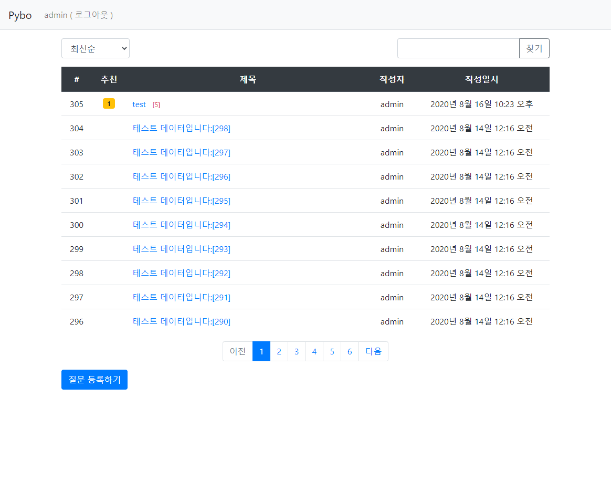
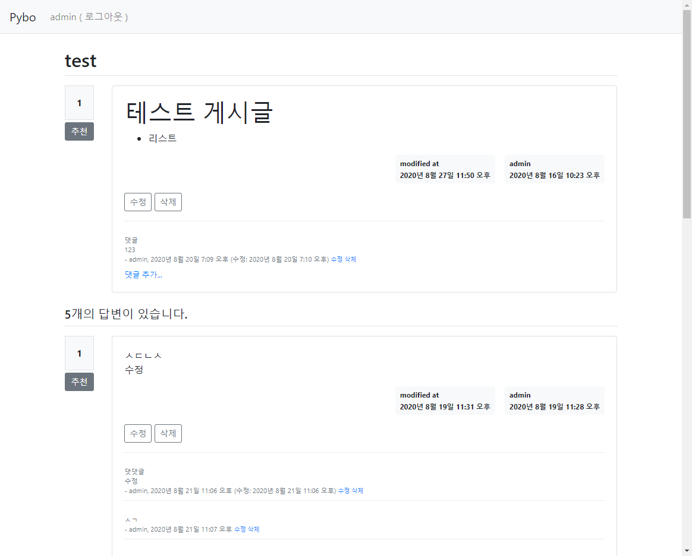

# 📗위키 독스 - 점프 투 장고로 빠르게 복습하기

## 🛵시작하기

1. 가상 환경 실행
   
2. `python manage.py runserver --settings=config.settings.{원하는 환경}` 입력
   1. `local`은 로컬 환경에서, `prod`는 배포 환경에서 넣어주면 된다.
   
> 또는 DJANGO_SETTING_MODULE을 이용하면 된다. [링크 참고](https://wikidocs.net/75560#_1)

## 🎨기능

- [x] 게시글 CRUD
- [x] 질문 CRUD
- [x] 댓글 CRUD
- [x] 검색 기능
- [x] 정렬 기능
- [x] 추천 기능
- [x] 페이지네이션
- [x] 회원가입, 로그인, 로그아웃
- [x] 마크다운으로 글쓰기
- [ ] 배포

## 📷스크린샷

<details>
    <summary>리스트 페이지</summary>
    
</details>

<details>
    <summary>상세 페이지</summary>
    
</details>

## 😎변경된 점

### No more JQuery!✋

강의에 포함되어있는 `JQuery`에 관한 내용을 전부 `Vanilla Javascript` 로 해결하였습니다.

#### Question_list

*before*
```js
$(document).ready(function(){
    $(".page-link").on('click', function() {
        $("#page").val($(this).data("page"));
        $("#searchForm").submit();
    });

    $("#btn_search").on('click', function() {
        $("#kw").val($(".kw").val());
        $("#page").val(1);
        $("#searchForm").submit();
    });

    $(".so").on('change', function() {
        $("#so").val($(this).val());
        $("#page").val(1);
        $("#searchForm").submit();
    });
});
```

*after*
```js
  const page_links = document.querySelectorAll(".page-link");
  const searchInput = document.querySelector(".kw");
  const btnSearch = document.getElementById("btn_search");
  const searchForm = document.getElementById("searchForm");
  const kw = document.getElementById("kw");
  const page = document.getElementById("page");
  const select = document.querySelector('.so');
  const so = document.getElementById('so');

  const onClick = (e) => {
    page.value = e.target.dataset.page;
    searchForm.submit();
  }

  const onSearch = (e) => {    
    kw.value = searchInput.value;
    page.value = 1;
    searchForm.submit();
  }

  const onSort = (e) => {
    so.value = e.target.value;
    page.value = 1;
    searchForm.submit(); // 중복되는 두 라인은 줄일 수 있을 듯하다.
  }

  page_links.forEach(link => link.addEventListener('click', onClick));
  btnSearch.addEventListener('click', onSearch);
  select.addEventListener('change', onSort);
```

[바로 가기](https://github.com/CaesiumY/jump-to-django/blob/f8fa952a35522a6f5421e65ec23a4fa8fb166feb/templates/pybo/question_list.html#L135)


#### Question_detail

*before*
```js
$(document).ready(function(){
    $(".delete").on('click', function() {
        if(confirm("정말로 삭제하시겠습니까?")) {
            location.href = $(this).data('uri');
        }
    });
    $(".recommend").on('click', function() {
        if(confirm("정말로 추천하시겠습니까?")) {
            location.href = $(this).data('uri');
        }
    });
});
```
*after*
```js
  const deleteBtn = document.querySelectorAll('.delete');
  const recommendBtn = document.querySelectorAll('.recommend');
  
  const onClick = (e) => {    
    const target = e.target.innerText;
    if(confirm(`정말로 ${target}하시겠습니까?`)) {      
      location.href = e.target.dataset.uri;
    }
  }

  deleteBtn.forEach(btn => btn.addEventListener('click', onClick));
  recommendBtn.forEach(btn => btn.addEventListener('click', onClick));

```

[바로 가기](https://github.com/CaesiumY/jump-to-django/blob/f8fa952a35522a6f5421e65ec23a4fa8fb166feb/templates/pybo/question_detail.html#L232)

## 참고 자료

### DB Browser for sqlite

https://sqlitebrowser.org/dl/

 GUI를 통해 데이터베이스의 상태를 보여줍니다.